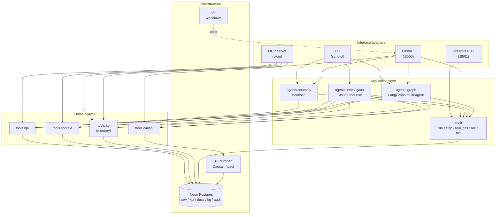

# Causal BI Agent

[](https://github.com/clavinci94/casual-bi-agent/actions/workflows/ci.yml)
[](backend/tests/)
[](https://www.python.org/)
[](LICENSE)

> Agentic Business Intelligence that explains **why**, not just **what** — with causal inference, organisational memory, and human-in-the-loop action.

## The pitch

Classic BI tools (Power BI, Tableau) show numbers. Modern "AI BI" tools (Hex Magic, Snowflake Cortex Analyst) answer text-to-SQL questions. Both leave the **why** to the analyst.

This platform:

1. **Monitors KPIs proactively** — notices anomalies without being asked.
2. **Runs causal inference** — separates correlation from causation via Bayesian Structural Time Series (`CausalImpact`) running in a stateless R service.
3. **Drafts actionable recommendations** — and routes them through human-in-the-loop approval.
4. **Remembers what worked** — every decision and its outcome flow into a knowledge graph, so the system gets smarter about *your* business over time.

On the deliberately-injected `mobile_checkout_v2` regression in the demo dataset, the system **rediscovers a -38.4 % causal effect with 95 % CI [-41.8 %, -34.7 %], p = 0.001**, automatically cross-references the relevant release, drafts a management-grade finding, and routes it through HITL. End-to-end in under 10 seconds.

## Architecture



Strict layering — see [`docs/clean-architecture.md`](docs/clean-architecture.md) for the dependency rules.

## Stack

| Concern | Tool |
|---|---|
| Database | Postgres 16 (`pgvector` for embeddings, `text` ids for psycopg compat) |
| Schema migrations | Alembic |
| Backend | Python 3.12, FastAPI, SQLAlchemy 2.x, psycopg 3 |
| Agent framework | LangGraph |
| LLM | Claude Sonnet 4.6 (pluggable via MCP) |
| Causal inference | R + `CausalImpact` via Plumber, in Docker |
| Tool protocol | MCP (Model Context Protocol) over stdio |
| HITL UI | Streamlit |
| HTTP API | FastAPI, Pydantic v2, OpenAPI 3.1 at `/docs` |
| Observability | JSON logs with request IDs, Sentry (env-gated) |
| Rate limiting | slowapi (in-memory, configurable backend) |
| Local dev | Docker Compose + uv + Makefile |
| Deploy | Render Blueprint + Neon |
| CI | GitHub Actions (lint + tests with ≥75 % coverage + Docker builds) |

## Local quickstart

```bash
git clone https://github.com/clavinci94/casual-bi-agent.git
cd casual-bi-agent

cp .env.example .env
make db-up                # Postgres + R service
make backend-sync         # uv sync inside backend/
make db-schemas           # alembic upgrade head

# either: full Olist + simulator (~3 min)
make db-load && make db-simulate
# or: minimal synthetic seed for quick demos (~30 s)
cd backend && uv run python scripts/seed_minimal.py && cd ..

# Heuristic detector (no LLM)
make detect-anomalies DETECT_ARGS="--date 2018-05-05"

# Causal R service (rediscovers the -38% effect)
make causal-smoke

# HTTP API on :8000 (OpenAPI at /docs)
make api-serve

# HITL approval UI on :8501
make hitl

# LLM investigator (needs ANTHROPIC_API_KEY in .env)
make investigate Q="What happened to mobile conversion rate in early May 2018?"
```

## Deploy to production

`infra/deploy.md` walks through Neon + Render in 10 minutes. Render Blueprint
(`infra/render.yaml`) provisions three services:

- **`biq-api`** — FastAPI backend with the agent loop
- **`biq-r-causal`** — R Plumber CausalImpact service (private, internal only)
- **`biq-hitl`** — Streamlit HITL approval queue

Set up:

1. Create Neon project (region: Europe / Frankfurt for EU data)
2. Push to GitHub, connect Render Blueprint to the repo
3. Create env group `biq-secrets`: `DATABASE_URL`, `ANTHROPIC_API_KEY`, `BIQ_API_KEY`, optional `SENTRY_DSN`
4. Apply blueprint — Render builds, migrates (`alembic upgrade head` on entry), starts

Migrations run on every deploy via the entrypoint — schema evolves safely.

## Operational notes

- **Schema migrations**: `cd backend && uv run alembic revision -m "what changed"` then edit the generated file.
- **Audit retention**: out of scope for the MVP. Add a cron task in n8n that prunes `audit.agent_steps` older than 90 days.
- **Rate limits**: default `120/minute/IP`, override with `BIQ_RATE_LIMIT` env.
- **Sentry**: set `SENTRY_DSN` to enable; unset = disabled.
- **Request tracing**: every HTTP response carries `X-Request-ID`; the same id is in the JSON log line. Use it to correlate logs across services.

## What's in `docs/`

| File | What |
|---|---|
| [`AGENTS.md`](AGENTS.md) | Operational guide for AI coding assistants (Claude Code, Cursor) |
| [`docs/architecture.md`](docs/architecture.md) | 5-layer data architecture + MCP topology |
| [`docs/clean-architecture.md`](docs/clean-architecture.md) | Domain / Application / Interface / Infrastructure mapping |
| [`docs/kpi-catalog.yaml`](docs/kpi-catalog.yaml) | Semantic-layer source of truth for KPIs |
| [`docs/mcp-clients.md`](docs/mcp-clients.md) | Claude Desktop / Cursor / Cline / n8n / Ollama setup |
| [`infra/deploy.md`](infra/deploy.md) | Neon + Render deploy walkthrough |
| [`CONTRIBUTING.md`](CONTRIBUTING.md) · [`SECURITY.md`](SECURITY.md) · [`CODE_OF_CONDUCT.md`](CODE_OF_CONDUCT.md) | Community policies |

## License

[MIT](LICENSE) © 2026 Claudio Vinci
