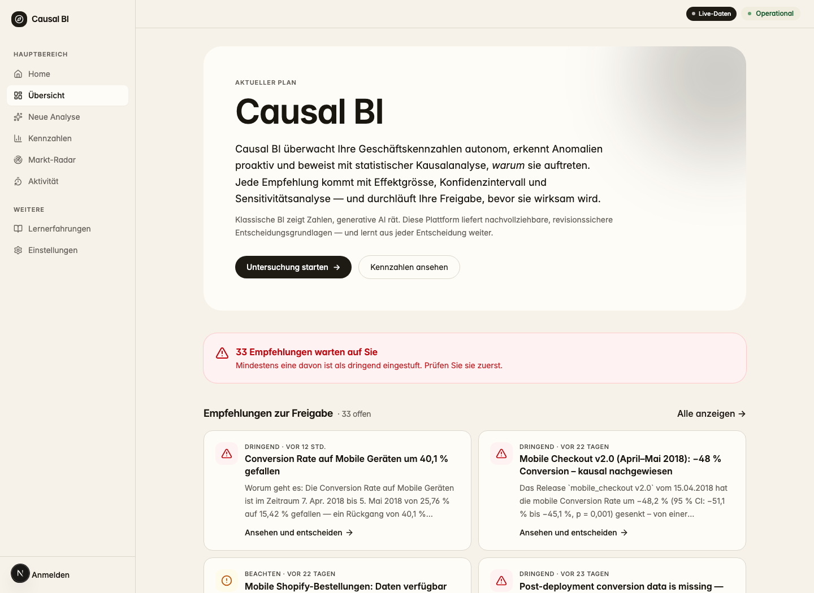
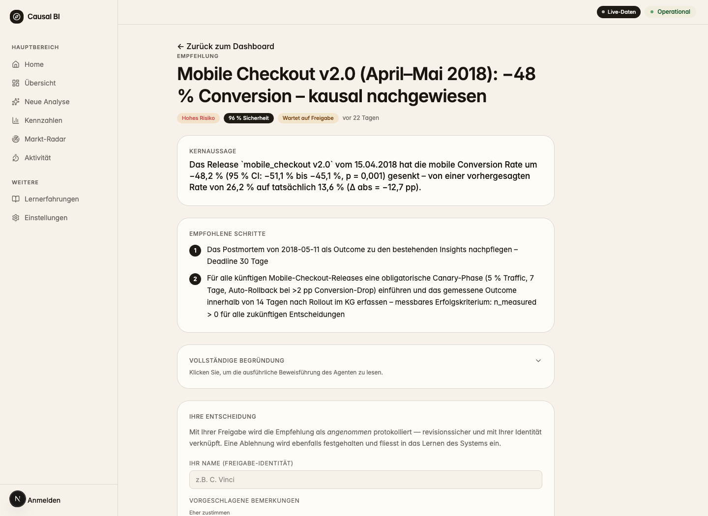
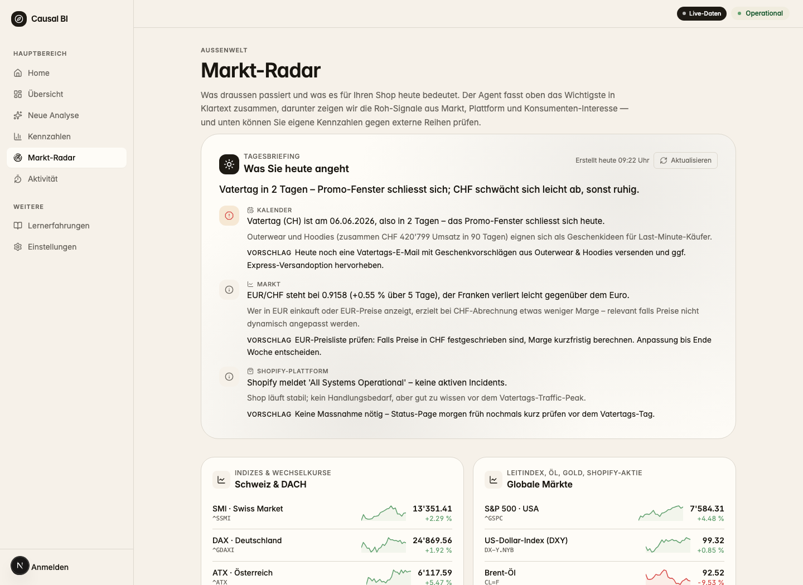
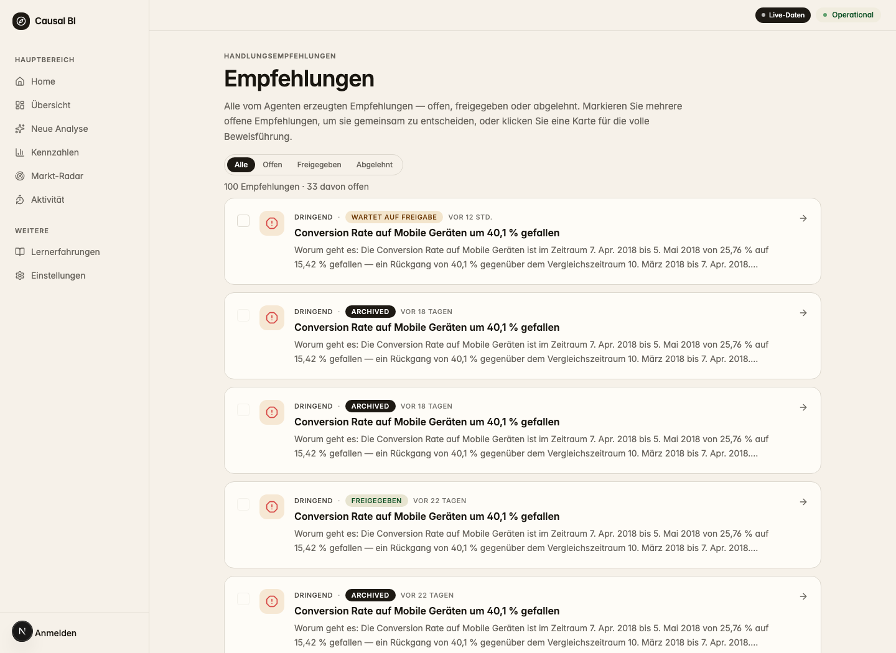
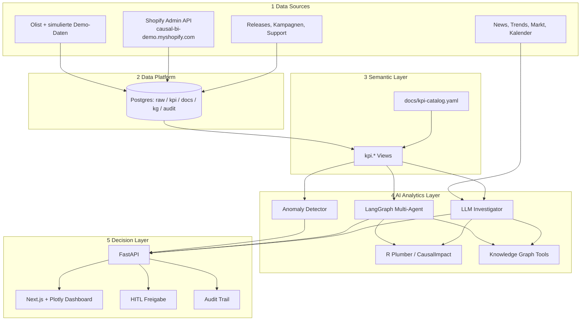
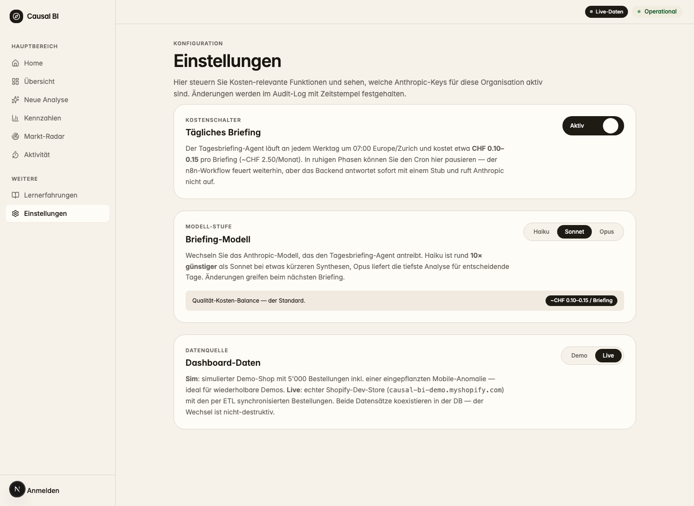
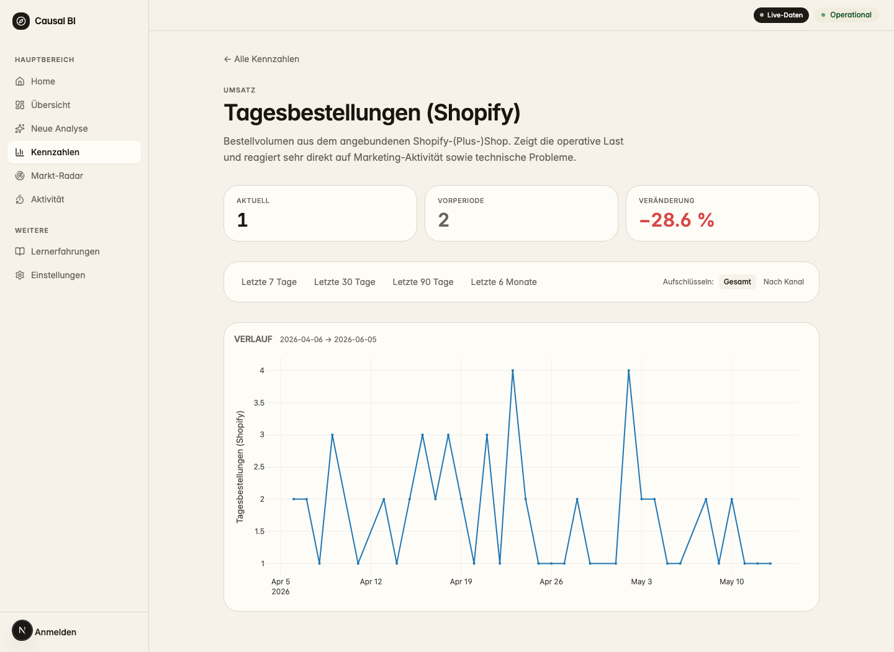

# Causal BI Agent

[](https://github.com/clavinci94/casual-bi-agent/actions/workflows/ci.yml?query=branch%3Amain)
[](backend/tests/)
[](https://www.python.org/)
[](LICENSE)

> Klassische BI zeigt, dass etwas passiert ist. **Causal BI erklärt warum, schlägt vor was zu tun ist, wartet auf menschliche Freigabe und misst danach, ob es funktioniert hat.**

**Causal BI Agent** ist ein agentisches Business-Intelligence-System für E-Commerce- und Shopify-Plus-Unternehmen. Es überwacht Geschäftszahlen nicht nur passiv wie ein Dashboard, sondern untersucht Auffälligkeiten selbstständig, prüft Ursachen statistisch, schreibt eine entscheidungsreife Empfehlung und speichert das spätere Ergebnis als organisationales Gedächtnis.

Das Projekt verbindet vier Dinge, die in klassischen BI-Tools meist getrennt sind:

1. **Proaktive KPI-Überwachung**: Conversion Rate, Bestellwert, Marge, Lieferzeit, Reviews, Refunds und Wiederkäufe werden laufend geprüft.
2. **Kausale Ursachenanalyse**: R/CausalImpact schätzt den Effekt einer Intervention mit Synthetic Controls, Konfidenzintervall und p-Wert.
3. **Agentische Entscheidungsunterstützung**: LangGraph- und LLM-Agenten wählen Tools, prüfen Kontext, formulieren Befunde und erstellen Management-Notizen.
4. **Human-in-the-Loop und Memory**: Jede Handlungsempfehlung braucht Freigabe. Entscheidung und Outcome landen im Knowledge Graph.

Der Demo-Case enthält absichtlich einen `mobile_checkout_v2`-Fehler. Das System findet ihn wieder, schätzt einen kausalen Effekt von **-38.4 %** mit **95 %-CI [-41.8 %, -34.7 %]** und **p = 0.001**, verknüpft den Befund mit dem Release und legt eine Empfehlung in die Freigabe-Queue.

Wichtig: Das System ist nicht nur auf synthetische Demodaten ausgelegt. Ein echter Shopify-Development-Store (`causal-bi-demo.myshopify.com`) wurde bereits angebunden und über die Shopify Admin API getestet. Simulierte Daten und live synchronisierte Shopify-Daten können parallel in derselben Datenbank koexistieren und im Dashboard umgeschaltet werden.

<p align="center">
  
</p>

<p align="center"><em>Dashboard-Überblick: Live-Datenmodus, offene Empfehlungen und Einstiegspunkte für Analyse, KPIs, Markt-Radar und Audit-Aktivität.</em></p>

## Warum das wichtig ist

Viele Unternehmen haben heute genug Dashboards, aber zu wenig Entscheidungen.

Ein Shopify-Plus-Shop kann täglich Tausende Bestellungen, Kampagnen, Support-Tickets, Produktänderungen und externe Marktimpulse erzeugen. Trotzdem werden kritische Fragen oft manuell beantwortet:

- Warum ist die Mobile Conversion gefallen?
- War die Kampagne wirklich wirksam oder wäre der Umsatz auch ohne sie gestiegen?
- Ist die Marge wegen Rabatten, Lieferkosten, Produktmix oder externer Marktlage gesunken?
- Hatten wir dieses Muster schon einmal, und was hat damals funktioniert?

Klassische BI beantwortet vor allem **was** passiert ist. Text-to-SQL-Copilots machen die Abfrage einfacher. Causal BI geht weiter: Es baut einen nachvollziehbaren Entscheidungsprozess von Daten über Ursache bis Handlung.

| Ohne Causal BI | Mit Causal BI |
|---|---|
| Manager sieht einen KPI-Abfall im Dashboard | Agent erkennt die Anomalie automatisch |
| Analyst sucht manuell nach Segmenten und Ursachen | Agent prüft KPI-Slices, Releases, Kampagnen, News und Trends |
| Ursache bleibt oft eine Vermutung | R-Service schätzt kausalen Effekt mit CI und p-Wert |
| Empfehlung landet in Slack, Mail oder Meeting-Notizen | Empfehlung wird freigegeben, auditiert und später gemessen |
| Wissen verschwindet mit Mitarbeitenden | Knowledge Graph speichert Insight, Decision und Outcome |

## Der Kern des Projekts

Causal BI ist kein weiteres Reporting-Tool. Es ist ein **agentischer Lernzyklus für Managemententscheidungen**.

```text
KPI beobachten
  -> Auffälligkeit erkennen
  -> Ursache untersuchen
  -> kausalen Effekt prüfen
  -> Empfehlung formulieren
  -> Mensch entscheidet
  -> Outcome messen
  -> Wissen für spätere Fälle speichern
```

Der wichtigste Produktgedanke: Ein BI-System soll nicht bei der Visualisierung aufhören. Es soll eine Entscheidung vorbereiten, die Entscheidung nachvollziehbar dokumentieren und später lernen, ob sie funktioniert hat.

## Methode

Das Projekt kombiniert klassische BI, Statistik und Agentic AI bewusst in klar getrennten Rollen.

| Baustein | Rolle im System | Warum es wichtig ist |
|---|---|---|
| **Semantic Layer** | KPI-Definitionen liegen zentral in `docs/kpi-catalog.yaml` und `kpi.*` Views | Der Agent darf keine uneinheitlichen Kennzahlen interpretieren |
| **Anomalie-Erkennung** | Heuristische Detektoren prüfen KPI-Zeitreihen und vermeiden Alert-Flut | Transparent, reproduzierbar und gut erklärbar |
| **CausalImpact in R** | Bayesian Structural Time Series mit Synthetic Controls | Trennt plausible Korrelation von belastbarer Wirkung |
| **LangGraph / LLM-Agenten** | Planen Tool-Aufrufe, sammeln Kontext, synthetisieren Management-Sprache | KI koordiniert und erklärt, erfindet aber keine Zahlen |
| **Human-in-the-Loop** | Empfehlungen werden vorbereitet, nicht automatisch ausgeführt | Der Mensch bleibt Entscheider bei Budget, Preisen und Kundenwirkung |
| **Audit Trail** | Jeder Run, Step, Tool-Call und jede Empfehlung wird gespeichert | Nachvollziehbarkeit statt Black Box |
| **Knowledge Graph** | Insight, Decision, Evidence und Outcome werden verknüpft | Das Unternehmen lernt aus eigenen Entscheidungen |

Das LLM ist dabei nicht der "Statistiker". Die Statistik kommt aus SQL, Python und R. Das LLM übernimmt Orchestrierung, Kontextverständnis und verständliche Kommunikation.

<p align="center">
  
</p>

<p align="center"><em>Entscheidungsvorlage statt Rohdaten: Effektgrösse, Unsicherheit, p-Wert, empfohlene Schritte und menschliche Freigabe in einer nachvollziehbaren Ansicht.</em></p>

## Was es besonders macht

### 1. Echte Kausalanalyse statt nur Korrelation

Viele BI- und Marketing-Tools zeigen Zusammenhänge. Causal BI prüft, ob eine beobachtete Veränderung plausibel auf eine Intervention zurückgeht. Im Demo-Fall wird der Mobile-Checkout-Release als Ursache nicht nur behauptet, sondern über CausalImpact quantifiziert.

### 2. Interne und externe Signale zusammen

Der Agent schaut nicht nur in die eigene Datenbank. Markt-Radar und Investigator nutzen auch:

- DACH-News und Wirtschaftspresse
- Google Trends für relevante Produktkategorien
- Yahoo-Finance-Marktdaten, Indizes, Öl, Gold, Währungen und Shopify-Aktie
- Shopify-Plattformstatus
- Commerce-Kalender mit Schweizer und DACH-relevanten Ereignissen

Damit kann das System unterscheiden, ob ein Problem intern entstanden ist oder durch Markt, Plattform, Saison oder externe Ereignisse beeinflusst wurde.

<p align="center">
  
</p>

<p align="center"><em>Markt-Radar: interne Shop-KPIs werden mit DACH-Markt, Kalender, Plattformstatus und externen Signalen verbunden.</em></p>

### 3. Entscheidungen werden nicht vergessen

Der Knowledge Graph macht aus einzelnen Analysen ein organisationales Gedächtnis:

```text
Insight -> Evidence -> Recommendation -> Human Decision -> Outcome
```

Nach einer Beobachtungsperiode misst das System, ob die freigegebene Massnahme funktioniert hat. Beim nächsten ähnlichen Vorfall kann der Agent frühere Entscheidungen und Ergebnisse heranziehen.

### 4. Governance ist eingebaut

Der Agent kann lesen, analysieren und Empfehlungen vorbereiten. Er darf aber keine riskanten externen Aktionen selbstständig ausführen. Preise, Budgets, E-Mails oder operative Massnahmen bleiben unter menschlicher Kontrolle.

<p align="center">
  
</p>

<p align="center"><em>Human-in-the-Loop: Empfehlungen werden priorisiert, geprüft und revisionssicher entschieden, bevor operative Massnahmen entstehen.</em></p>

## Geschäftlicher Nutzen

Zielgruppe sind Shopify-Plus- und E-Commerce-Brands im DACH-Raum mit relevanter Datenmenge, aber ohne grosses internes Analytics-Team.

| Rolle | Nutzen |
|---|---|
| Geschäftsführung | Schneller von "Problem gesehen" zu "Entscheidung bereit" |
| COO / Operations | Ursachen für Lieferzeit-, Refund- oder Support-Probleme schneller finden |
| Marketing Lead | Kampagnenwirkung sauberer beurteilen und Budgetfehler vermeiden |
| CFO | Empfehlungen mit Effektgrösse, Unsicherheit und Audit Trail prüfen |
| Neue Mitarbeitende | Frühere Entscheidungen und Outcomes im Knowledge Graph nachschlagen |

Ein realistischer Verkaufsfall:

Eine Brand mit CHF 30 Mio. Jahresumsatz verliert durch eine Mobile-Conversion-Krise mehrere Wochen Umsatz, weil das Problem erst spät auffällt und die Ursache manuell gesucht wird. Wenn Causal BI dieselbe Krise innerhalb von 48 Stunden erkennt, statistisch erklärt und eine konkrete Massnahme vorbereitet, kann ein einziger vermiedener Vorfall einen Jahrespreis mehrfach rechtfertigen.

## Starkes Verkaufsargument

> Causal BI ist der erste Analytics-Mitarbeiter, der nie schläft, jede wichtige KPI-Abweichung prüft, Ursachen mit statistischer Strenge bewertet, eine konkrete Entscheidungsvorlage schreibt und später selbst misst, ob die Entscheidung funktioniert hat.

Kurz gesagt:

**Nicht mehr "Zeig mir ein Dashboard", sondern "Bereite mir die beste nächste Entscheidung vor".**

## Abgrenzung zum Markt

| Alternative | Was Sie Gut Kann | Grenze |
|---|---|---|
| Shopify Analytics | Schnelle Standardreports | Reaktiv, keine Ursachenanalyse, kein Lernzyklus |
| Power BI / Tableau | Starke Dashboards und Enterprise Reporting | Erklärt nicht automatisch Ursache und nächste Handlung |
| Text-to-SQL-Copilots | Fragen in natürlicher Sprache auf Daten stellen | Antwortet auf Fragen, überwacht aber nicht proaktiv |
| Marketing-Attribution-Tools | Paid-Media-Kanäle vergleichen | Enger Fokus, oft keine Operations-, Markt- oder Support-Signale |
| Beratungs-/Analytics-Agentur | Menschliche Expertise | Langsam, teuer, Wissen bleibt selten systematisch im Unternehmen |
| **Causal BI** | Proaktive Anomalie, kausale Prüfung, Empfehlung, Freigabe, Outcome-Memory | Fokussiert bewusst auf E-Commerce und Shopify-Plus |

Die Differenzierung liegt nicht in einem einzelnen Feature, sondern in der Kette: **erkennen -> erklären -> empfehlen -> freigeben -> messen -> lernen**.

## Architektur



Mehr Details stehen in [`docs/architecture.md`](docs/architecture.md) und [`docs/clean-architecture.md`](docs/clean-architecture.md).

## Implementierter Stand

| Bereich | Status |
|---|---|
| Postgres-Schemas `raw`, `kpi`, `docs`, `kg`, `audit` | Implementiert |
| KPI Semantic Layer mit Governance | Implementiert |
| Olist-Demo-Daten und synthetischer Mobile-Checkout-Bug | Implementiert |
| Shopify-Connector mit getesteter Dev-Store-Anbindung | Implementiert |
| Sim/Live-Datenumschaltung für Shopify-KPIs | Implementiert |
| Anomalie-Erkennung | Implementiert |
| R-Service mit CausalImpact, E-Value und Power-Analyse | Implementiert |
| LLM-Investigator mit Tool-Use | Implementiert |
| LangGraph Multi-Agent-Pipeline | Implementiert |
| FastAPI mit OpenAPI | Implementiert |
| Next.js/Plotly Dashboard inklusive Markt-Radar | Implementiert |
| HITL-Freigabe und Audit Trail | Implementiert |
| Knowledge Graph mit Insight, Decision, Evidence, Outcome | Implementiert |
| Eval-Harness und CI | Implementiert |
| Cloud-Deployment mit Render/Neon/Vercel-Architektur | Bereits deployed, erprobt und dokumentiert |
| SSO, Multi-Tenant, White-Label | Ausbaufähige nächste Schritte |

## Datenquellen und Betriebsstand

Das Projekt unterstützt drei Datenmodi:

| Modus | Zweck | Stand |
|---|---|---|
| **Olist + Simulator** | Reproduzierbarer End-to-End-Case mit bekannter Ursache | Vollständig integriert |
| **Simulierter Shopify-Plus-Shop** | Realistischere Shop-KPIs über `raw.shopify_*` und `kpi.shopify_*` | Vollständig integriert |
| **Echter Shopify-Dev-Store** | Admin-API-Sync gegen `causal-bi-demo.myshopify.com` | Angebunden und getestet |

Der Shopify-Pfad ist bewusst so gebaut, dass Demo- und Live-Daten nebeneinander liegen. Jede Zeile in `raw.shopify_orders`, `raw.shopify_customers` und `raw.shopify_products` trägt eine `data_source`-Markierung (`sim` oder `live`). Die `kpi.shopify_*`-Views lesen über eine Session-Konfiguration genau den aktuell gewählten Datenmodus. Dadurch kann dasselbe Dashboard wahlweise mit reproduzierbaren Demodaten oder mit echten Shopify-Sync-Daten arbeiten, ohne Views umzubauen oder Daten zu löschen.

<p align="center">
  
</p>

<p align="center"><em>Datenmodus im Dashboard: Demo- und Live-Shopify-Daten koexistieren in derselben Datenbank und können nicht-destruktiv umgeschaltet werden.</em></p>

<p align="center">
  
</p>

<p align="center"><em>Shopify-Live-KPI: die angebundene Admin-API liefert echte Bestellzeitreihen, die im gleichen KPI-Layer wie die Demodaten visualisiert werden.</em></p>

Der Betriebsstand geht über lokale Ausführung hinaus: Backend, R-Service und HITL-Service sind über Docker/Render beschrieben, die Datenplattform ist für Neon Postgres ausgelegt, und das Next.js-Dashboard ist Vercel-ready. Der Stack wurde im Projektkontext bereits deployed und erprobt; die Infrastruktur-Dateien bleiben im Repo, damit der Stand reproduzierbar und ausbaufähig ist. Der technische Ablauf ist in [`infra/deploy.md`](infra/deploy.md) dokumentiert.

## Lokaler Quickstart

```bash
git clone https://github.com/clavinci94/casual-bi-agent.git
cd casual-bi-agent

cp .env.example .env
make db-up                # Postgres + R service
make backend-sync         # uv sync inside backend/
make db-schemas           # alembic upgrade head

# Voller Demo-Datensatz
make db-load && make db-simulate

# Oder schneller Minimal-Seed für Demos
cd backend && uv run python scripts/seed_minimal.py && cd ..

# Heuristische Anomalie-Erkennung ohne LLM
make detect-anomalies DETECT_ARGS="--date 2018-05-05"

# R/CausalImpact Smoke-Test
make causal-smoke

# API und UI
make api-serve
make hitl

# LLM-Investigation, benötigt ANTHROPIC_API_KEY in .env
make investigate Q="What happened to mobile conversion rate in early May 2018?"
```

## Technologie

| Bereich | Technologie |
|---|---|
| Backend | Python 3.12, FastAPI, SQLAlchemy, Alembic |
| Agenten | LangGraph, Claude Sonnet, MCP |
| Statistik | R, Plumber, CausalImpact |
| Datenbank | Postgres 16, pgvector, relationale KG-Fallback-Struktur |
| Frontend | Next.js, Plotly |
| HITL | Streamlit |
| Workflows | n8n |
| Tests | pytest, eval harness, GitHub Actions |
| Deployment | Render, Neon, Vercel-ready Frontend |

## Wichtige Dokumente

| Datei | Zweck |
|---|---|
| [`docs/course-mapping.md`](docs/course-mapping.md) | Mapping von Leistungsnachweis-Vorgaben zu Projektartefakten |
| [`docs/architecture.md`](docs/architecture.md) | 5-Layer-Architektur und Datenflüsse |
| [`docs/clean-architecture.md`](docs/clean-architecture.md) | Domain, Application, Interface und Infrastructure Layer |
| [`docs/kpi-catalog.yaml`](docs/kpi-catalog.yaml) | KPI-Semantik als Source of Truth |
| [`docs/shopify-setup.md`](docs/shopify-setup.md) | Shopify-Dev-Store-Anbindung |
| [`docs/mcp-clients.md`](docs/mcp-clients.md) | MCP-Setup für Claude Desktop, Cursor, Cline und n8n |
| [`infra/deploy.md`](infra/deploy.md) | Cloud-Betrieb mit Render, Neon und Vercel |

## Bewusste Grenzen

Das MVP fokussiert auf **Ursachenanalyse und Entscheidungsvorbereitung**, nicht auf eine komplette BI-Suite. Forecasting, Multi-Tenant-Betrieb, SSO, White-Label und Self-Service-KPI-Konfiguration sind sinnvolle nächste Schritte, aber nicht der Kernbeweis dieses Projekts.

Der Kernbeweis lautet: Ein BI-Agent kann aus strukturierten Daten, externer Weltinformation, Statistik und menschlicher Freigabe einen nachvollziehbaren Entscheidungsprozess bauen.

## Lizenz

[MIT](LICENSE) © 2026 Claudio Vinci
